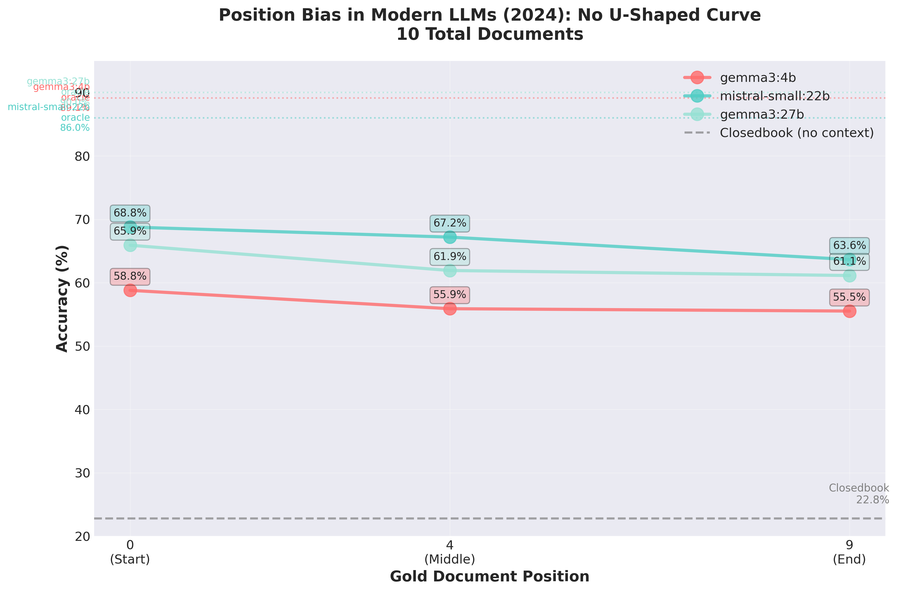
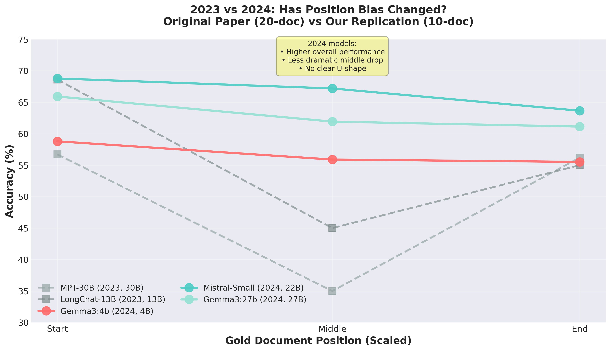

# Lost in the Middle: Ollama Model Replication (2024)

> **Replication Study**: This repository replicates the "Lost in the Middle" experiments using modern locally-available Ollama models (Gemma3, Mistral) from 2024 to test whether position bias persists in contemporary language models. The objective of this experiment is not to disprove or contest any of the original findings but to test how much (if any) progression has occured in one year. 

> **Defining progression**:

>   **GPU**- Original study used NVIDIA A100's vs. a single NVIDIA RTX 4090

>   **Models**- Gemma3 and Mistral were able to respond without thinking tokens, reasoning models such as Qwen3.5 scored 3/2655 on the pilot and were excluded.
 

## About This Replication

This work extends the original ["Lost in the Middle: How Language Models Use Long Contexts"](https://arxiv.org/abs/2307.03172) (Liu et al., 2023) research by testing modern 2024 models (gemma3:4b, mistral-small:22b, gemma3:27b) using local inference via Ollama. The study compares architectures (Gemma's interleaved local/global attention vs Mistral's standard attention) and replicates the multi-document QA experiments with 10-document position bias tests.

### Key Findings

Main Discovery: The U-shaped curve is eliminated. Modern 2024 models no longer exhibit the classic position bias pattern from 2023.

**Oracle Performance** (Upper Bound - Single Gold Document):
- gemma3:27b: **90.02%** accuracy (2,389/2,655 correct)
- gemma3:4b: **89.15%** accuracy (2,365/2,655 correct)
- mistral-small:22b: **85.99%** accuracy (2,283/2,655 correct)

**10-Document Position Bias** (1 gold + 9 distractors):

| Model | Position 0 (Start) | Position 4 (Middle) | Position 9 (End) | Pattern |
|-------|-------------------|---------------------|------------------|---------|
| gemma3:4b | **58.8%** | 55.9% | 55.5% | Gradual decline |
| mistral-small:22b | **68.8%** | 67.2% | 63.7% | Gradual decline |
| gemma3:27b | **65.9%** | 61.9% | 61.1% | Gradual decline |

**Closedbook Baseline** (No context): 22.8%

**Key Observations**:
- No U-shape: Performance doesn't recover at end (position 9 is worst, not better)
- Primacy bias persists: All models best at start (position 0)
- No recency bias: Unlike 2023, end position shows worst performance
- Models use context: 10-doc accuracy (55-69%) significantly exceeds closedbook (23%)
- Less degradation: ~20% better than 2023 models (28% drop vs 47% in original paper)

**Comparison with Original Paper** (2023):
- 2023 Pattern: START (high) → MIDDLE (low) → END (high) = U-shaped curve
- 2024 Pattern: START (high) → MIDDLE (medium) → END (low) = Gradual decline
- Improvement: +4-8% oracle accuracy, ~20% less position degradation

Conclusion: Modern models show meaningful progress in handling long contexts, but primacy bias remains a challenge.

### Experimental Details

- **Duration**: ~12 hours on single RTX 4090
- **Experiments**: 13 experiments × 2,655 examples = 34,515 total predictions
- **Models Tested**: 3 (Gemma3:4b, Mistral-Small:22b, Gemma3:27b)
- **Dataset**: NaturalQuestions-Open (Kwiatkowski et al., 2019)
- **Setup**: Oracle (1 doc), 10-doc positioned (positions 0, 4, 9), Closedbook (0 docs)

### Quick Start (Ollama Models)

```bash
# 1. Install minimal dependencies (no GPU packages needed - Ollama handles it)
pip install -r requirements-ollama.txt

# 2. Ensure Ollama is running
ollama serve

# 3. Pull models
ollama pull gemma3:4b
ollama pull mistral-small:22b
ollama pull gemma3:27b

# 4. Verify setup
python scripts/verify_setup.py

# 5. Run oracle test (baseline)
python scripts/get_qa_responses_from_ollama.py \
    --model gemma3:4b \
    --input-path qa_data/nq-open-oracle.jsonl.gz \
    --output-path results/test_oracle.jsonl.gz \
    --temperature 0.0 \
    --max-new-tokens 100

# 6. Evaluate
python scripts/evaluate_qa_responses.py --input-path results/test_oracle.jsonl.gz

# 7. Run full experiments (see Context/experiment_plan.md)
bash scripts/run_ollama_experiments.sh
```

### Visualizations

<p align="center">
  
  
</p>

**Left**: Position vs accuracy for 2024 models - no U-shaped recovery at end position.
**Right**: Comparison with 2023 models showing eliminated U-curve but persistent primacy bias.

See [`Context/results/`](./Context/results/) for all visualizations.

### Documentation

All replication documentation is in the [`Context/`](./Context/) directory:
- [`Context/FINDINGS.md`](./Context/FINDINGS.md) - Complete analysis (15,000 words)
- [`Context/RESULTS_SUMMARY.md`](./Context/RESULTS_SUMMARY.md) - Detailed result tables
- [`Context/PILOT_RESULTS.md`](./Context/PILOT_RESULTS.md) - Pilot test journey (includes Qwen reasoning model discovery)
- [`Context/models.txt`](./Context/models.txt) - Model selection rationale
- [`Context/specs.md`](./Context/specs.md) - Detailed model specifications (Gemma3, Mistral)
- [`Context/CHANGELOG.md`](./Context/CHANGELOG.md) - Code modifications log

Original paper and additional context:
- Original Paper: [arXiv:2307.03172](https://arxiv.org/abs/2307.03172)
- Original Repository: [nelson-liu/lost-in-the-middle](https://github.com/nelson-liu/lost-in-the-middle)
- Original Data & Scripts: Available in the original repository above

### Implications

**For Practitioners**:
- RAG systems more robust: Modern models handle multi-document context better than 2023
- Position still matters: Place critical information at the start (+3-5% accuracy)
- Full context helps: Models effectively use all documents (2.4-2.8× better than no context)
- Architecture matters: Mistral-Small:22b outperforms larger Gemma3:27b (consider beyond just size)

**For Researchers**:
- Progress made: +20% less position degradation in one year
- Open question: What eliminated recency bias? (End position now worst, not better)
- Future work: Test at extreme context lengths (32K-128K tokens), different tasks, more architectures

### New Code (Ollama Integration)

- [`src/lost_in_the_middle/ollama_client.py`](./src/lost_in_the_middle/ollama_client.py) - Ollama API client
- [`scripts/get_qa_responses_from_ollama.py`](./scripts/get_qa_responses_from_ollama.py) - QA experiments
- [`scripts/run_after_mistral.sh`](./scripts/run_after_mistral.sh) - Automated experiment runner
- [`scripts/create_visualizations.py`](./scripts/create_visualizations.py) - Generate analysis plots
- [`scripts/monitor_progress.sh`](./scripts/monitor_progress.sh) - Progress monitoring

### License & Attribution

This replication study builds upon the original work by Liu et al. (2023), which is licensed under MIT License.

**Original Work**:
- **Paper**: Liu, N. F., Lin, K., Hewitt, J., Paranjape, A., Bevilacqua, M., Petroni, F., & Liang, P. (2023). Lost in the Middle: How Language Models Use Long Contexts. *arXiv preprint arXiv:2307.03172*.
- **Repository**: [github.com/nelson-liu/lost-in-the-middle](https://github.com/nelson-liu/lost-in-the-middle)
- **License**: MIT License

**This Replication** (new code and analysis):
- **License**: MIT License (maintaining compatibility)
- **New Contributions**: Ollama integration, 2024 model testing, updated analysis

### Citation

If you use this replication study, **please cite both** the original work and this replication:

```bibtex
@misc{lost_in_middle_ollama_2026,
  title={Lost in the Middle: Ollama Model Replication (2024)},
  author={[Your Name]},
  year={2026},
  howpublished={\url{https://github.com/YOUR_USERNAME/lost-in-the-middle-ollama-replication}},
  note={Replication study testing position bias in Gemma3 and Mistral models}
}

@article{liu2023lost,
  title={Lost in the Middle: How Language Models Use Long Contexts},
  author={Liu, Nelson F. and Lin, Kevin and Hewitt, John and Paranjape, Ashwin and Bevilacqua, Michele and Petroni, Fabio and Liang, Percy},
  journal={arXiv preprint arXiv:2307.03172},
  year={2023}
}
```

### Acknowledgments

- **Original Research**: Liu et al. (2023) for the foundational work and open-source codebase under MIT License
- **Datasets**: NaturalQuestions-Open (Kwiatkowski et al., 2019)
- **Model Providers**: Google (Gemma3), Mistral AI (Mistral-Small)
- **Infrastructure**: Ollama team for local inference framework
- **Development**: Claude Sonnet 4.5 for implementation assistance

---

# Original Repository: Lost in the Middle

**Original Authors**: Nelson F. Liu, Kevin Lin, John Hewitt, Ashwin Paranjape, Michele Bevilacqua, Fabio Petroni, Percy Liang

**Paper**: [Lost in the Middle: How Language Models Use Long Contexts](https://arxiv.org/abs/2307.03172)

This repository contains the original accompanying material for the paper.

## Table of Contents

- [Installation](#installation)
- [Multi-Document Question Answering Experiments](#multi-document-question-answering-experiments)
- [Multi-Document Question Answering Data](#multi-document-question-answering-data)
  * [Generating new multi-document QA data.](#generating-new-multi-document-qa-data)
- [Key-Value Retrieval Experiments](#key-value-retrieval-experiments)
- [Key-Value Retrieval Data](#key-value-retrieval-data)
  * [Generating new key-value retrieval data](#generating-new-key-value-retrieval-data)
- [Testing Prompting Templates](#testing-prompting-templates)
- [References](#references)

## Installation

1. Set up a conda environment

``` sh
conda create -n lost-in-the-middle python=3.9 --yes
conda activate lost-in-the-middle
```

2. Install package and requirements

``` sh
pip install -e .
```

3. (optional) set up pre-commit hooks for development.

``` sh
pre-commit install
```

## Multi-Document Question Answering Experiments

See [EXPERIMENTS.md](./EXPERIMENTS.md#multi-document-question-answering) for
instructions to run and evaluate models on the multi-document QA task.

## Multi-Document Question Answering Data

[`qa_data/`](./qa_data/) contains multi-document question answering data for the
oracle setting (1 input document, which is exactly the passage that answers the
question) and 10-, 20-, and 30-document settings (where 1 input passage answers
the question, and the other passages do not contain an NQ-annotated answer).

Each line of this gzipped file is in the following format:

``` sh
{
  "question": "who got the first nobel prize in physics",
  "answers": [
    "Wilhelm Conrad Röntgen"
  ],
  "ctxs": [
    ...
    {
      "id": <string id, e.g., "71445">,
      "title": <string title of the wikipedia article that this passage comes from>,
      "text": <string content of the passage>,
      "score": <string relevance score, e.g. "1.0510446">,
      "hasanswer": <boolean, whether any of the values in the `answers` key appears in the text>,
      "original_retrieval_index": <int indicating the original retrieval index. for example, a value of 0 indicates that this was the top retrieved document>,
      "isgold": <boolean, true or false indicating if this chunk is the gold answer from NaturalQuestions>
    },
    ...
  ],
  "nq_annotated_gold": {
    "title": <string title of the wikipedia article containing the answer, as annotated in NaturalQuestions>,
    "long_answer": "<string content of the paragraph element containing the answer, as annotated in NaturalQuestions>",
    "chunked_long_answer": "<string content of the paragraph element containing the answer, randomly chunked to approximately 100 words>",
    "short_answers": [
      <string short answers, as annootated in NaturalQuestions>
    ]
  }
}
```

### Generating new multi-document QA data.

1. First, download Contriever retrieval results for each of the queries:

``` sh
wget https://nlp.stanford.edu/data/nfliu/lost-in-the-middle/nq-open-contriever-msmarco-retrieved-documents.jsonl.gz
```

2. Then, to generate examples with 20 total documents with the relevant documents at positions 0, 4, 9, 14, and 19, run:

``` sh
for gold_index in 0 4 9 14 19; do
    python -u ./scripts/make_qa_data_from_retrieval_results.py \
        --input-path nq-open-contriever-msmarco-retrieved-documents.jsonl.gz \
        --num-total-documents 20 \
        --gold-index ${gold_index} \
        --output-path qa_data/nq-open-20_total_documents_gold_at_${gold_index}.jsonl.gz
done
```

## Key-Value Retrieval Experiments

See [EXPERIMENTS.md](./EXPERIMENTS.md#key-value-retrieval) for
instructions to run and evaluate models on the key-value retrieval task.

## Key-Value Retrieval Data

[`kv_retrieval_data/`](./kv_retrieval_data/) contains multi-document question answering data for the
oracle setting (1 input document, which is exactly the passage the answers the
question) and 10-, 20-, and 30-document settings (where 1 input passage answers
the question, and the other passages do not contain an NQ-annotated answer).

Each line of this gzipped file is in the following format:

``` sh
{
  "ordered_kv_records": [
    ...
    [
      "adde4211-888b-48e3-9dbe-66c66551b05f",
      "8bc3e90d-e044-4923-9a5d-7bf48917ed39"
    ],
    [
      "2a8d601d-1d69-4e64-9f90-8ad825a74195",
      "bb3ba2a5-7de8-434b-a86e-a88bb9fa7289"
    ],
    [
      "006b46ef-03fd-4380-938c-49cb03754370",
      "9faeacbe-1d0e-40da-a5db-df598a104880"
    ],
    ...
  ],
  "key": "2a8d601d-1d69-4e64-9f90-8ad825a74195",
  "value": "bb3ba2a5-7de8-434b-a86e-a88bb9fa7289"
}
```

The `ordered_kv_records` is a list of `[key, value]` pairs. The `key` specifies
a particular key to retrieve from `ordered_kv_records`, and the `value` lists
its expected associated value.

### Generating new key-value retrieval data

To generate new key-value retrieval data, use:

``` sh
python -u ./scripts/make_kv_retrieval_data.py \
    --num-keys 300 \
    --num-examples 500 \
    --output-path kv-retrieval_data/kv-retrieval-300_keys.jsonl.gz
```

## Testing Prompting Templates

Code for converting the examples into string prompts is in
[`src/lost_in_the_middle/prompting.py`](./src/lost_in_the_middle/prompting.py). 
After following the installation instructions above, you can run tests with:

``` sh
$ py.test tests/
========================================= test session starts =========================================
platform linux -- Python 3.9.17, pytest-7.4.0, pluggy-1.2.0
rootdir: /home/nfliu/git/lost-in-the-middle
collected 7 items

tests/test_prompting.py .......                                                                 [100%]

========================================== 7 passed in 0.08s ==========================================
```

## References

Please consider citing our work if you found this code or our paper beneficial to your research.

```
@misc{liu-etal:2023:arxiv,
  author    = {Nelson F. Liu  and  Kevin Lin  and  John Hewitt  and Ashwin Paranjape  and Michele Bevilacqua  and  Fabio Petroni  and  Percy Liang},
  title     = {Lost in the Middle: How Language Models Use Long Contexts},
  note      = {arXiv:2307.03172},
  year      = {2023}
}
```
